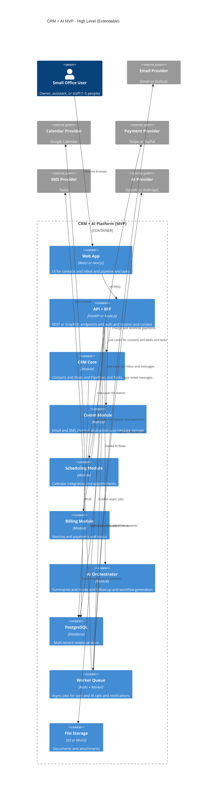

# CRM + AI MVP - Big Picture

## Overview

This diagram shows the high-level architecture of the CRM + AI MVP system, including all planned modules for the complete product vision. It illustrates how different components will work together to provide a comprehensive CRM solution for small offices (1-5 people).

**Note:** This represents the **future state** after all MVP modules are implemented. For the current implementation status, see [architecture.md](./architecture.md).

## System Architecture Diagram

## Module Descriptions

### Core Modules (MVP)

1. **CRM Core**
   - Contact management (✅ Implemented)
   - Deal pipeline tracking
   - Task management
   - Relationship tracking

2. **Scheduling Module** (✅ Phase 1 Complete)
   - Staff management (✅ Implemented)
   - Appointment booking (✅ Implemented)
   - Calendar integration (Planned: iCal export)
   - Automated reminders (Planned)
   - Availability management (✅ Data model implemented)

3. **Communication Module** (Planned)
   - Unified inbox (email + SMS)
   - Message threading
   - Channel abstraction
   - Two-way sync with email providers

4. **Billing Module** (Planned)
   - Invoice generation
   - Payment processing
   - Payment status tracking
   - Integration with Stripe/PayPal

5. **AI Orchestrator** (Planned)
   - Email/message summaries
   - Automated intake forms
   - Follow-up suggestions
   - Workflow generation
   - Integration with OpenAI/Anthropic

### Infrastructure Components

- **PostgreSQL**: Multi-tenant relational data store (currently SQLite in dev)
- **Worker Queue**: Background job processing (Redis + worker processes)
- **File Storage**: Document and attachment management (S3 or MinIO)

### External Integrations

- **Email Providers**: Gmail, Outlook for bidirectional email sync
- **Calendar**: Google Calendar integration via iCal/ICS format
- **Payment**: Stripe or PayPal for invoice payments
- **SMS**: Twilio for text message reminders
- **AI**: OpenAI (GPT) or Anthropic (Claude) for AI features

## Current Implementation Status

### ✅ Completed (Phase 1)
- Clean Architecture directory structure
- Contact management CRUD
- Staff management CRUD
- Appointment booking and management
- Database models for scheduling
- Health check endpoints
- Comprehensive test suite (29 tests passing)

### 🚧 In Progress
- Availability management endpoints
- Slot calculation algorithm
- Conflict detection logic

### 📋 Planned (Future Phases)
- iCal calendar export
- Automated reminder system
- Email/SMS communication module
- AI-powered features
- Billing and invoicing
- Multi-tenant support

## Related Documentation

- [Detailed Architecture](./architecture.md) - Clean Architecture implementation details
- [C4 Model Diagrams](./C4.md) - Multiple levels of architectural diagrams
- [README](../README.md) - Project overview and setup instructions

---

**Last Updated:** 2025-12-14
**Status:** Phase 1 Complete (Scheduling Foundation)
