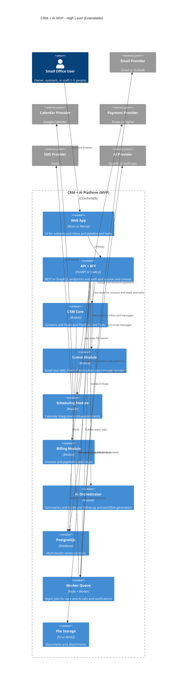

```mermaid
C4Container
    title CRM + AI MVP - High Level (Extendable)

    Person(user, "Small Office User", "Owner, assistant, or staff (1-5 people)")

    Container_Boundary(crm, "CRM + AI Platform (MVP)") {
        Container(web, "Web App", "React or Next.js", "UI for contacts and inbox and pipeline and tasks")
        Container(api, "API + BFF", "FastAPI or Node.js", "REST or GraphQL endpoints and auth and session and context")
        Container(crmCore, "CRM Core", "Module", "Contacts and Deals and Pipelines and Tasks")
        Container(comm, "Comm Module", "Module", "Email and SMS channel abstraction and message storage")
        Container(sched, "Scheduling Module", "Module", "Calendar integration and appointments")
        Container(bill, "Billing Module", "Module", "Invoices and payments and status")
        Container(ai, "AI Orchestrator", "Module", "Summaries and intake and follow-up and workflow generation")
        Container(db, "PostgreSQL", "Database", "Multi-tenant relational store")
        Container(queue, "Worker Queue", "Redis + Worker", "Async jobs for sync and AI calls and notifications")
        Container(files, "File Storage", "S3 or MinIO", "Documents and attachments")
    }

    System_Ext(email, "Email Provider", "Gmail or Outlook")
    System_Ext(calendar, "Calendar Provider", "Google Calendar")
    System_Ext(pay, "Payment Provider", "Stripe or PayPal")
    System_Ext(sms, "SMS Provider", "Twilio")
    System_Ext(llm, "AI Provider", "OpenAI or Anthropic")

    Rel(user, web, "Uses via browser")
    Rel(web, api, "HTTP(S)")
    Rel(api, crmCore, "Use cases for contacts and deals and tasks")
    Rel(api, comm, "Use cases for inbox and messages")
    Rel(api, sched, "Use cases for events")
    Rel(api, bill, "Use cases for invoices and payments")
    Rel(api, ai, "Invoke AI flows")

    Rel(crmCore, db, "CRUD")
    Rel(comm, db, "Store messages and threads")
    Rel(bill, db, "Store invoices and payments")
    Rel(api, queue, "Publish async jobs")
    Rel(queue, email, "Sync email messages")
    Rel(queue, sms, "Send SMS")
    Rel(queue, llm, "Call LLM for AI tasks")
    Rel(sched, calendar, "Sync events")
    Rel(bill, pay, "Charge and reconcile payments")
    Rel(api, files, "Upload and download documents")

    UpdateLayoutConfig($c4ShapeInRow="3", $c4BoundaryInRow="1")
```

