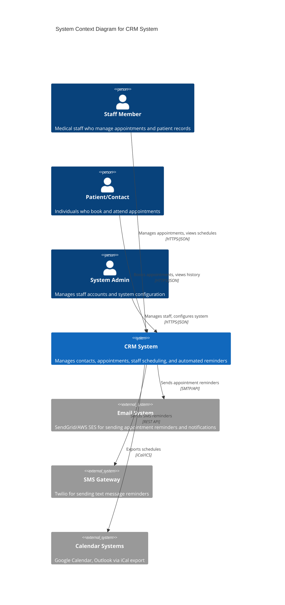
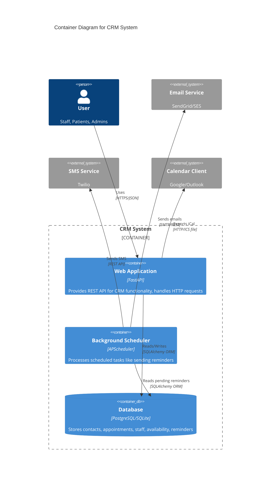
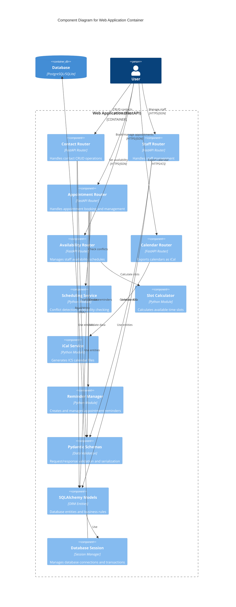
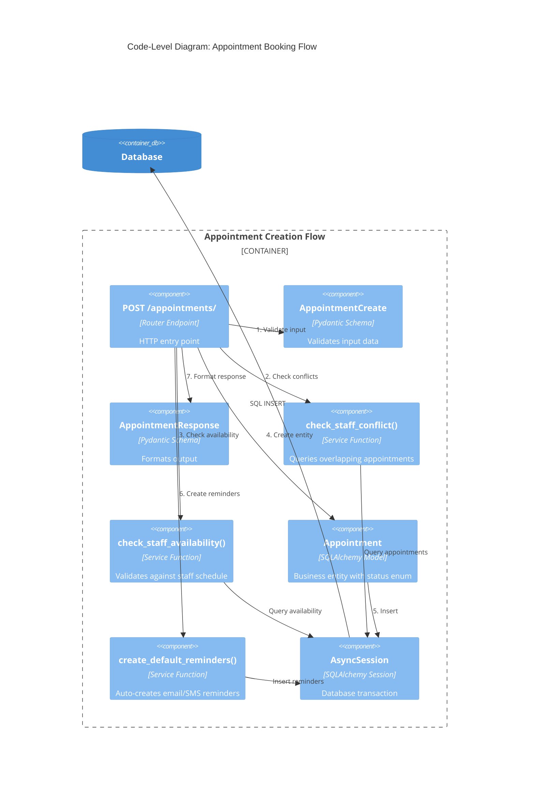
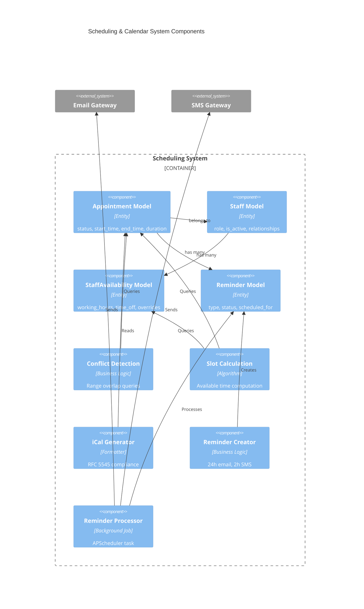
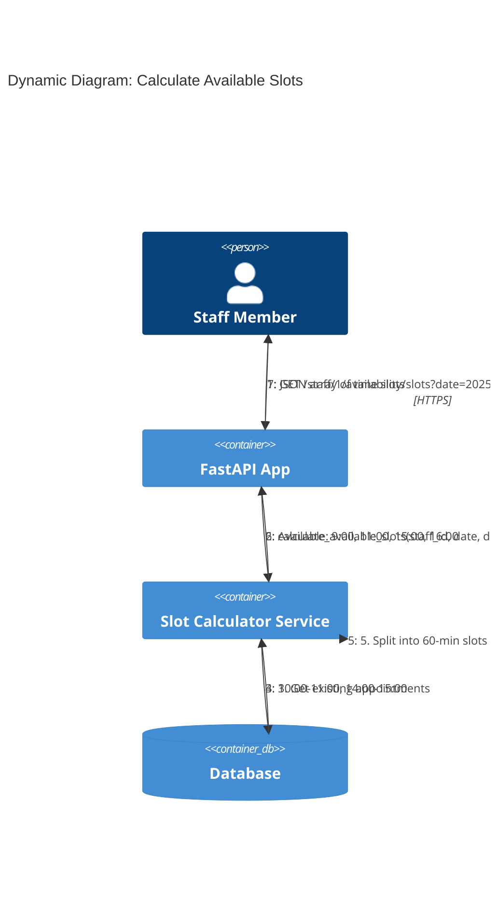
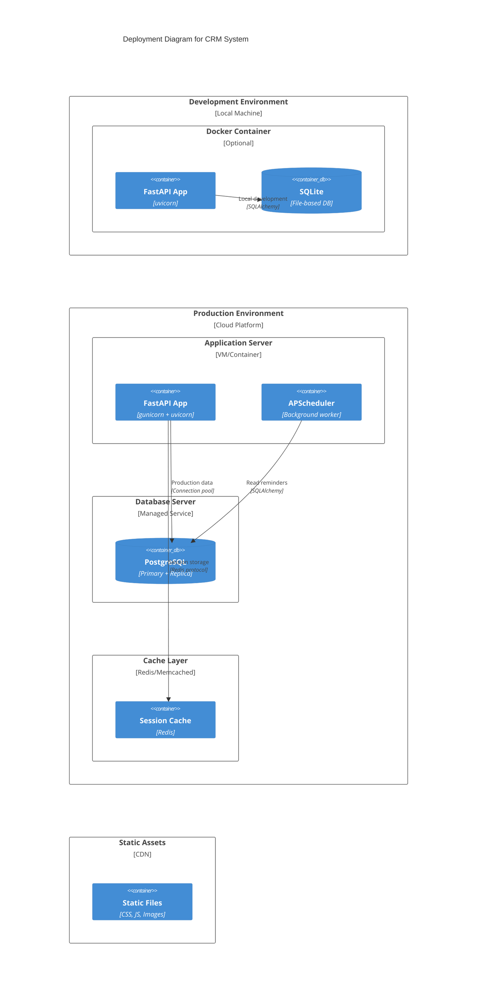
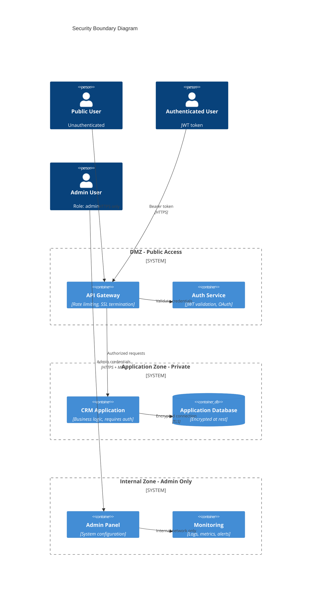

# C4 Model Architecture Diagrams

This document provides multiple levels of architectural diagrams using the C4 model (Context, Containers, Components, Code) for the CRM + AI system.

## About C4 Model

The C4 model provides a hierarchical way to visualize software architecture at different levels of abstraction:
1. **Level 1 (Context)**: How the system fits into the world
2. **Level 2 (Containers)**: High-level technology choices
3. **Level 3 (Components)**: Internal structure of containers
4. **Level 4 (Code)**: Implementation details (classes, functions)

## Table of Contents
1. [Level 1: System Context](#level-1-system-context)
2. [Level 2: Container Diagram](#level-2-container-diagram)
3. [Level 3: Component Diagram](#level-3-component-diagram)
4. [Additional Diagrams](#additional-diagrams)
   - [Dynamic Diagram](#dynamic-diagram-appointment-booking-flow)
   - [Deployment Diagram](#deployment-diagram)
   - [Security Architecture](#security-architecture)

---

## Level 1: System Context

Shows how the CRM system fits into the world around it - who uses it and what other systems it integrates with.

**Key Elements:**
- **Staff Members**: Create/manage appointments, view schedules, manage availability
- **Patients/Contacts**: Book appointments, receive reminders
- **System Admins**: Configure system, manage staff accounts
- **External Systems**: Email, SMS, Calendar integrations

---

## Level 2: Container Diagram

Shows the high-level technology choices and how containers communicate.

**Containers:**
1. **Web Application (FastAPI)**: REST API, business logic, request handling
2. **Background Scheduler (APScheduler)**: Automated reminder processing
3. **Database (PostgreSQL/SQLite)**: Persistent storage

**Technology Choices:**
- **FastAPI**: Async Python web framework
- **SQLAlchemy**: ORM for database access
- **Alembic**: Database migrations
- **Pydantic**: Data validation
- **APScheduler**: Background job scheduling

---

## Level 3: Component Diagram

Shows the components inside the Web Application container.

**Component Groups:**

### Routers (Controllers - Layer 3)
- **Contact Router**: `/api/v1/contacts/*` - Contact management
- **Staff Router**: `/api/v1/staff/*` - Staff CRUD operations
- **Appointment Router**: `/api/v1/appointments/*` - Appointment booking
- **Availability Router**: `/api/v1/staff/{id}/availability/*` - Schedule management
- **Calendar Router**: `/api/v1/calendar/*` - iCal exports

### Services (Use Cases - Layer 2)
- **Scheduling Service**: Conflict detection, availability validation
- **Slot Calculator**: Available time slot computation
- **iCal Service**: Calendar file generation
- **Reminder Manager**: Reminder creation and scheduling

### Data Layer (Layer 1 & 3)
- **Pydantic Schemas**: Input/output validation, DTOs
- **SQLAlchemy Models**: Entities (Contact, Staff, Appointment, etc.)
- **Database Session**: Connection pooling, transaction management

---

## Level 4: Code Diagram

### Appointment Booking Flow

**Execution Flow:**
1. Validate input with `AppointmentCreate` schema
2. Check for conflicting appointments (business rule)
3. Verify staff availability for requested time
4. Create `Appointment` entity with calculated end_time
5. Persist to database
6. Auto-create email/SMS reminders
7. Return validated response via `AppointmentResponse`

---

## Scheduling System Components Detail

---

## Data Flow: Available Slot Calculation

**Algorithm Steps:**
1. Retrieve working hours for requested date
2. Remove time-off periods (vacation, breaks)
3. Remove existing appointments (booked slots)
4. Calculate remaining time windows
5. Split windows into slots of requested duration
6. Return sorted list of available start times

---

## Deployment Diagram

---

## Security Boundaries

---

## Summary

### C4 Model Levels Overview

| Level | Diagram Type   | Audience                         | Purpose                          |
|-------|----------------|----------------------------------|----------------------------------|
| 1     | System Context | Non-technical stakeholders       | How the system fits in the world |
| 2     | Container      | Technical leadership, architects | High-level technology choices    |
| 3     | Component      | Developers, architects           | Internal structure of containers |
| 4     | Code           | Developers                       | Implementation details, classes  |

### Key Architectural Patterns

1. **Clean Architecture**: Entities → Use Cases → Interface Adapters → Frameworks
2. **Repository Pattern**: Database access abstraction (SQLAlchemy ORM)
3. **Dependency Injection**: FastAPI's `Depends()` for session management
4. **DTO Pattern**: Pydantic schemas for data validation/serialization
5. **Background Jobs**: APScheduler for async task processing
6. **API Gateway Pattern**: Single entry point with routing

### Technology Stack Summary

| Layer         | Technology        | Purpose                      |
|---------------|-------------------|------------------------------|
| API Framework | FastAPI           | Async REST API, OpenAPI docs |
| ORM           | SQLAlchemy 2.0    | Async database access        |
| Validation    | Pydantic 2.x      | Schema validation            |
| Database      | PostgreSQL/SQLite | Persistent storage           |
| Migration     | Alembic           | Schema version control       |
| Scheduling    | APScheduler       | Background jobs              |
| Calendar      | iCalendar         | RFC 5545 exports             |
| Testing       | pytest-asyncio    | Async test framework         |

---

## Related Documentation

- [Clean Architecture Details](./architecture.md) - Comprehensive architecture documentation
- [Big Picture Overview](./BIG_PICTURE.md) - High-level MVP vision and module roadmap
- [README](../README.md) - Project overview and setup instructions

**Document Version:** 1.1
**Last Updated:** 2025-12-14
**Generated by:** Claude Code

**External References:**
- [C4 Model](https://c4model.com/)
- [Mermaid C4 Diagrams](https://mermaid.js.org/syntax/c4.html)
