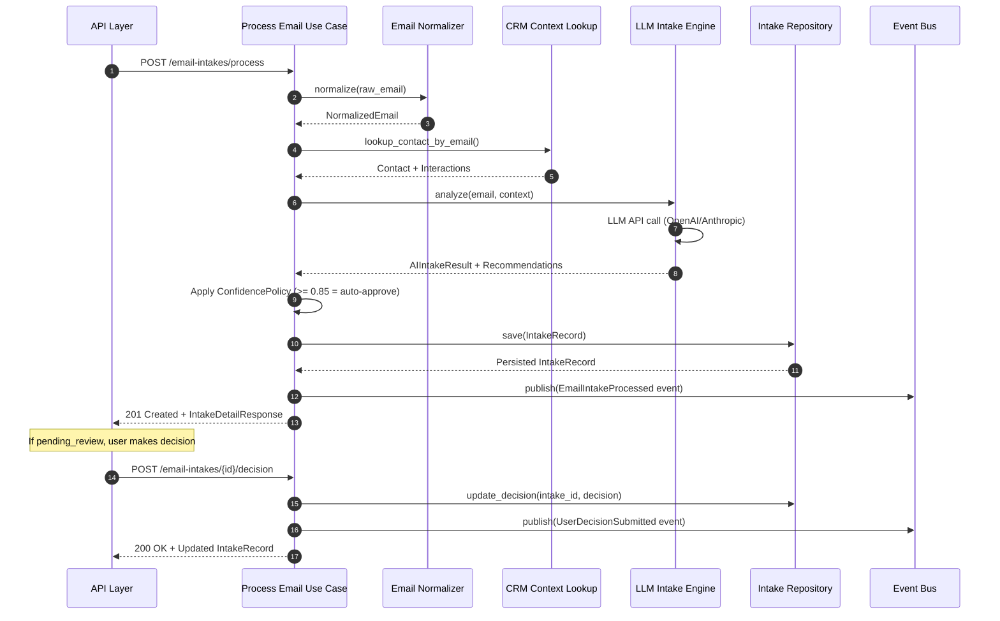

# Email Intake Component

## Overview

The Email Intake Component is an AI-powered system that automatically processes inbound emails, analyzes their content, and generates actionable recommendations for tasks and deals. Built using Clean Architecture principles, it provides a complete workflow from raw email to CRM actions with optional human review.

## Architecture

### Sequence Diagram



## Current Implementation Status

### ✅ Phase 1-5: Complete (Production-Ready)

**Implemented Features:**
- ✅ Email normalization (HTML cleaning, quoted reply removal)
- ✅ AI-powered analysis (OpenAI & Anthropic support)
- ✅ Task and deal recommendations
- ✅ Confidence-based auto-approval (threshold: 0.85)
- ✅ Human review workflow
- ✅ Full REST API with 4 endpoints
- ✅ Database persistence with JSON columns
- ✅ 50 unit tests + integration tests

**Not Yet Implemented:**
- ⏳ Email webhook receiver (Phase 6 - planned)
- ⏳ Real Task Service integration (Phase 7 - using stubs)
- ⏳ Real Pipeline Service integration (Phase 7 - using stubs)
- ⏳ Real Event Bus (Phase 8 - using stub logger)

## Core Components

### 1. Domain Layer (Zero Framework Dependencies)

**Value Objects:**
- `EmailAddress` - Email with optional name
- `EmailHeaders` - Subject, date, message ID, thread info
- `EmailBody` - Raw HTML, raw text, normalized text
- `Summary` - AI-generated summary with key points
- `Intent` - Classification (inquiry, complaint, request, follow_up, other)
- `ExtractedEntity` - People, dates, money, organizations
- `Confidence` - Overall score + reasoning
- `TaskRecommendation` - Title, description, priority, due date
- `DealRecommendation` - Contact, stage, value, notes

**Entities:**
- `NormalizedEmail` - Complete email representation
- `AIIntakeResult` - AI analysis results
- `IntakeRecord` - Aggregate root with business logic

**Domain Events:**
- `EmailIntakeProcessed` - Published after email analysis
- `UserDecisionSubmitted` - Published after user decision

### 2. Application Layer (Use Cases)

**ProcessInboundEmailUseCase:**
1. Normalize email
2. Lookup CRM context (contact + interactions)
3. AI analysis with context
4. Create IntakeRecord with status
5. Persist to database
6. Publish EmailIntakeProcessed event

**SubmitUserDecisionUseCase:**
1. Load intake record
2. Create approved tasks (via stub)
3. Create approved deals (via stub)
4. Update status (user_approved/rejected)
5. Publish UserDecisionSubmitted event

### 3. Adapters Layer

**Inbound:**
- `email_intake.router` - 4 REST endpoints

**Outbound:**
- `EmailNormalizer` - BeautifulSoup HTML cleaning
- `CRMContextLookup` - SQLAlchemy queries
- `LLMIntakeEngine` - OpenAI/Anthropic with retry logic
- `IntakeRepository` - JSON serialization for domain ↔ ORM
- `StubEventBus` - Logger-based event publishing
- `StubTaskService` - Placeholder task creation
- `StubPipelineService` - Placeholder deal creation

## API Endpoints

### POST /api/v1/email-intakes/process

Process a raw email through the AI pipeline.

**Request:**
```json
{
  "raw_email": {
    "from": "customer@example.com",
    "to": ["support@company.com"],
    "subject": "Question about pricing",
    "text": "What are your enterprise options?",
    "html": "<p>What are your enterprise options?</p>",
    "date": "2025-12-16T10:30:00Z",
    "message_id": "<abc123@mail.example.com>"
  }
}
```

**Response (201 Created):**
```json
{
  "id": 1,
  "status": "pending_review",
  "sender_email": "customer@example.com",
  "subject": "Question about pricing",
  "summary": "Customer inquiry about enterprise pricing options.",
  "key_points": ["Interested in enterprise pricing"],
  "intent": "inquiry",
  "confidence_score": 0.82,
  "task_recommendations": [
    {
      "title": "Follow up on pricing inquiry",
      "description": "Send enterprise pricing sheet",
      "priority": "high",
      "due_date": "2025-12-20"
    }
  ],
  "deal_recommendations": [
    {
      "contact_email": "customer@example.com",
      "deal_stage": "qualification",
      "value": 5000.0,
      "notes": "Enterprise pricing inquiry"
    }
  ]
}
```

### GET /api/v1/email-intakes/pending

List all emails pending human review.

**Query Parameters:**
- `skip` (default: 0) - Pagination offset
- `limit` (default: 50, max: 100) - Results per page

**Response (200 OK):**
```json
{
  "items": [
    {
      "id": 1,
      "status": "pending_review",
      "sender_email": "customer@example.com",
      "subject": "Question about pricing",
      "confidence_score": 0.82,
      "intent": "inquiry",
      "summary": "Customer inquiry...",
      "task_count": 1,
      "deal_count": 1,
      "created_at": "2025-12-16T10:30:00",
      "updated_at": "2025-12-16T10:30:00"
    }
  ],
  "total": 1,
  "skip": 0,
  "limit": 50
}
```

### GET /api/v1/email-intakes/{id}

Get detailed intake analysis.

**Response (200 OK):**
Same as POST /process response.

### POST /api/v1/email-intakes/{id}/decision

Submit user decision on AI recommendations.

**Request:**
```json
{
  "approved_task_indices": [0],
  "approved_deal_indices": [0]
}
```

**Response (200 OK):**
Updated IntakeRecord with status changed to `user_approved` or `rejected`.

## Configuration

### Environment Variables (.env)

```env
# AI / Email Intake
AI_PROVIDER=openai              # "openai" or "anthropic"
AI_MODEL=gpt-4o-mini            # or "claude-3-5-sonnet-20241022"
OPENAI_API_KEY=sk-...           # Your OpenAI API key
ANTHROPIC_API_KEY=sk-ant-...    # Your Anthropic API key
```

### ConfidencePolicy

```python
AUTO_APPROVE_THRESHOLD = 0.85   # Auto-approve if confidence >= 0.85
HIGH_CONFIDENCE_THRESHOLD = 0.70  # High confidence indicator
LOW_CONFIDENCE_THRESHOLD = 0.40   # Low confidence indicator
```

## Database Schema

### email_intakes Table

```sql
CREATE TABLE email_intakes (
    -- Primary key & timestamps (from mixins)
    id INTEGER PRIMARY KEY,
    created_at DATETIME DEFAULT CURRENT_TIMESTAMP,
    updated_at DATETIME DEFAULT CURRENT_TIMESTAMP,

    -- Status tracking
    status VARCHAR(50) NOT NULL,  -- pending_review, auto_approved, user_approved, rejected

    -- JSON storage for complex nested data
    raw_email_json TEXT NOT NULL,
    normalized_email_json TEXT NOT NULL,
    ai_result_json TEXT NOT NULL,
    recommendations_json TEXT NOT NULL,
    decision_json TEXT,

    -- Denormalized fields for quick filtering
    sender_email VARCHAR(255) NOT NULL,
    subject VARCHAR(500) NOT NULL,
    confidence_score FLOAT NOT NULL
);

-- Indexes
CREATE INDEX idx_email_status_confidence ON email_intakes (status, confidence_score);
CREATE INDEX idx_email_sender_created ON email_intakes (sender_email, created_at);
CREATE INDEX ix_email_intakes_status ON email_intakes (status);
CREATE INDEX ix_email_intakes_sender_email ON email_intakes (sender_email);
CREATE INDEX ix_email_intakes_confidence_score ON email_intakes (confidence_score);
```

## AI Analysis Details

### LLM Prompt Structure

The LLM receives:
1. **Email Content**: From, subject, body (cleaned)
2. **CRM Context**: Existing contact info, recent interactions
3. **Analysis Requirements**: Summary, intent, entities, recommendations
4. **Output Format**: Structured JSON with specific fields

### Intent Classification

- `inquiry` - Asking for information
- `complaint` - Expressing dissatisfaction
- `request` - Requesting action/service
- `follow_up` - Following up on previous communication
- `other` - Uncategorized

### Entity Extraction

- `PERSON` - Names of people mentioned
- `DATE` - Specific dates or time references
- `MONEY` - Dollar amounts
- `ORGANIZATION` - Company names

Each entity includes confidence score (0.0-1.0).

### Retry Logic

Uses Tenacity library:
- 3 retry attempts
- Exponential backoff (2s, 4s, 8s)
- Handles transient API failures

## Testing

### Unit Tests (50 total)

**Domain Tests (35):**
- Value objects validation
- Entity business logic
- `is_reply()`, `should_auto_approve()`, etc.

**Use Case Tests (15):**
- Orchestration with mocked ports
- Confidence threshold boundary testing
- Error handling

**Run Tests:**
```bash
# All unit tests
uv run pytest tests/unit/ -v

# Integration tests
uv run pytest tests/integration/ -v

# All tests with coverage
uv run pytest --cov=app
```

## Future Enhancements

### Phase 6: Email Webhook Receiver
- Implement POST /webhooks/email endpoint
- Support SendGrid, Mailgun, generic webhooks
- Email signature verification

### Phase 7: Real Service Integration
- Replace StubTaskService with real task creation
- Replace StubPipelineService with real deal creation
- Bidirectional sync with CRM

### Phase 8: Event-Driven Architecture
- Replace StubEventBus with RabbitMQ/Redis
- Async event consumers
- Event sourcing for audit trail

### Additional Features
- Email thread detection and grouping
- Sentiment analysis
- Priority scoring
- Automatic follow-up suggestions
- Multi-language support
- Custom entity types

## Troubleshooting

### AI API Errors

**Problem:** 500 error "AI service unavailable"

**Solutions:**
1. Check API keys in `.env`
2. Verify API key has sufficient quota
3. Check network connectivity
4. Review retry logs for specific errors

### Low Confidence Scores

**Problem:** All emails marked as `pending_review`

**Solutions:**
1. Improve email context (ensure contacts exist)
2. Adjust `AUTO_APPROVE_THRESHOLD` in `ConfidencePolicy`
3. Fine-tune LLM prompt for your domain
4. Use more powerful model (e.g., GPT-4 vs GPT-4o-mini)

### Missing Recommendations

**Problem:** No tasks/deals suggested

**Solutions:**
1. Check email content clarity
2. Review LLM response parsing logs
3. Verify prompt includes recommendation requirements
4. Check JSON serialization in repository

## References

- [Email_Intake_Component.md](./Email_Intake_Component.md) - Component diagram
- [architecture.md](./architecture.md) - Overall system architecture
- [C4.md](./C4.md) - C4 model diagrams
