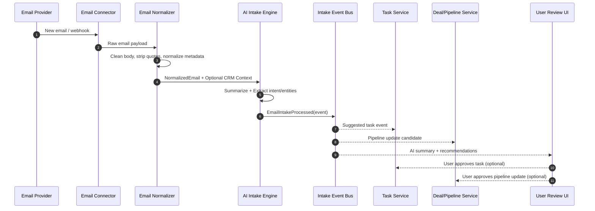

```mermaid
sequenceDiagram
    autonumber
    participant E as Email Provider
    participant C as Email Connector
    participant N as Email Normalizer
    participant A as AI Intake Engine
    participant B as Intake Event Bus
    participant T as Task Service
    participant D as Deal/Pipeline Service
    participant U as User Review UI

    E->>C: New email / webhook
    C->>N: Raw email payload
    N->>N: Clean body, strip quotes, normalize metadata
    N->>A: NormalizedEmail + Optional CRM Context

    A->>A: Summarize + Extract intent/entities
    A->>B: EmailIntakeProcessed(event)

    B-->>T: Suggested task event
    B-->>D: Pipeline update candidate
    B-->>U: AI summary + recommendations

    U-->>T: User approves task (optional)
    U-->>D: User approves pipeline update (optional)
```
