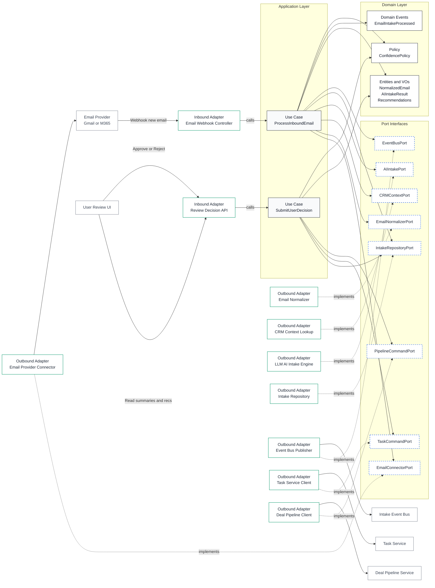

```mermaid
flowchart LR
  %% ==========
  %% Styles
  %% ==========
  classDef domain fill:#ffffff,stroke:#111827,stroke-width:1px,color:#111827;
  classDef app fill:#f9fafb,stroke:#111827,stroke-width:1px,color:#111827;
  classDef port fill:#ffffff,stroke:#2563eb,stroke-width:1.5px,color:#1f2937,stroke-dasharray:4;
  classDef adapter fill:#ffffff,stroke:#059669,stroke-width:1.2px,color:#1f2937;
  classDef external fill:#ffffff,stroke:#6b7280,stroke-width:1px,color:#374151;

  %% ==========
  %% External systems
  %% ==========
  EmailProvider[Email Provider<br/>Gmail or M365]:::external
  TaskSvc[Task Service]:::external
  DealSvc[Deal Pipeline Service]:::external
  EventBus[Intake Event Bus]:::external
  ReviewUI[User Review UI]:::external

  %% ==========
  %% Inbound adapters
  %% ==========
  WebhookCtrl[Inbound Adapter<br/>Email Webhook Controller]:::adapter
  ReviewAPI[Inbound Adapter<br/>Review Decision API]:::adapter

  %% ==========
  %% Core: Domain Layer
  %% ==========
  subgraph DOM[Domain Layer]
    direction TB
    DomainModels[Entities and VOs<br/>NormalizedEmail<br/>AIIntakeResult<br/>Recommendations]:::domain
    DomainEvents[Domain Events<br/>EmailIntakeProcessed]:::domain
    DomainPolicy[Policy<br/>ConfidencePolicy]:::domain
  end

  %% ==========
  %% Core: Application Layer
  %% ==========
  subgraph APP[Application Layer]
    direction TB
    UC1[Use Case<br/>ProcessInboundEmail]:::app
    UC2[Use Case<br/>SubmitUserDecision]:::app
  end

  %% ==========
  %% Core: Port Interfaces
  %% ==========
  subgraph PORTS[Port Interfaces]
    direction TB
    PEmailConnector[EmailConnectorPort]:::port
    PNormalizer[EmailNormalizerPort]:::port
    PCRMContext[CRMContextPort]:::port
    PAIIntake[AIIntakePort]:::port
    PRepo[IntakeRepositoryPort]:::port
    PEventBus[EventBusPort]:::port
    PTaskCmd[TaskCommandPort]:::port
    PPipeCmd[PipelineCommandPort]:::port
  end

  %% ==========
  %% Outbound adapters
  %% ==========
  EmailConnAdapter[Outbound Adapter<br/>Email Provider Connector]:::adapter
  NormalizerAdapter[Outbound Adapter<br/>Email Normalizer]:::adapter
  CRMContextAdapter[Outbound Adapter<br/>CRM Context Lookup]:::adapter
  LLMAdapter[Outbound Adapter<br/>LLM AI Intake Engine]:::adapter
  RepoAdapter[Outbound Adapter<br/>Intake Repository]:::adapter
  EventBusAdapter[Outbound Adapter<br/>Event Bus Publisher]:::adapter
  TaskClient[Outbound Adapter<br/>Task Service Client]:::adapter
  DealClient[Outbound Adapter<br/>Deal Pipeline Client]:::adapter

  %% ==========
  %% Flows: inbound -> use cases
  %% ==========
  EmailProvider -->|Webhook new email| WebhookCtrl
  WebhookCtrl -->|calls| UC1

  ReviewUI -->|Read summaries and recs| ReviewAPI
  ReviewUI -->|Approve or Reject| ReviewAPI
  ReviewAPI -->|calls| UC2

  %% ==========
  %% Use cases -> ports (inward dependencies)
  %% ==========
  UC1 --> PEmailConnector
  UC1 --> PNormalizer
  UC1 --> PCRMContext
  UC1 --> PAIIntake
  UC1 --> PRepo
  UC1 --> PEventBus

  UC2 --> PRepo
  UC2 --> PTaskCmd
  UC2 --> PPipeCmd

  %% ==========
  %% Adapters implement ports (outside -> boundary)
  %% ==========
  EmailConnAdapter -.implements.-> PEmailConnector
  NormalizerAdapter -.implements.-> PNormalizer
  CRMContextAdapter -.implements.-> PCRMContext
  LLMAdapter -.implements.-> PAIIntake
  RepoAdapter -.implements.-> PRepo
  EventBusAdapter -.implements.-> PEventBus
  TaskClient -.implements.-> PTaskCmd
  DealClient -.implements.-> PPipeCmd

  %% ==========
  %% Adapters talk to externals
  %% ==========
  EmailConnAdapter --> EmailProvider
  EventBusAdapter --> EventBus
  TaskClient --> TaskSvc
  DealClient --> DealSvc

  %% ==========
  %% Domain relationships (pure, internal)
  %% ==========
  UC1 --> DomainModels
  UC1 --> DomainEvents
  UC1 --> DomainPolicy
  UC2 --> DomainModels
  UC2 --> DomainPolicy
```