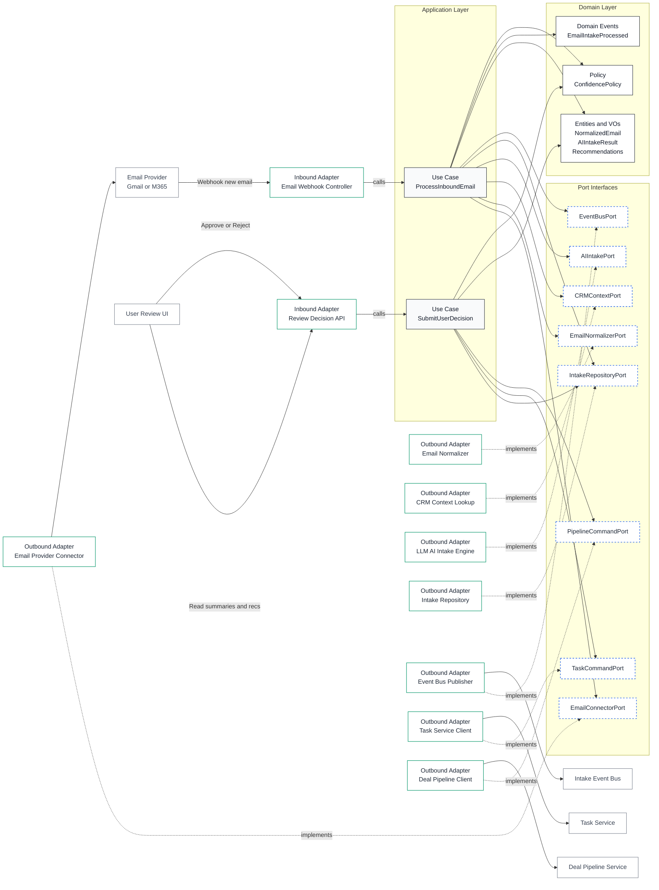

# Email Intake Component Architecture

## Overview

This diagram illustrates the Email Intake Component following Clean Architecture (Hexagonal/Ports & Adapters) principles. The architecture ensures complete separation between business logic and infrastructure concerns.

## Implementation Status

### ✅ Implemented (Phases 1-5)
- **Domain Layer**: All entities, value objects, and policies
- **Application Layer**: Both use cases (ProcessInboundEmail, SubmitUserDecision)
- **Ports**: All 8 port interfaces defined
- **Adapters**:
  - ✅ EmailNormalizer (HTML cleaning, metadata extraction)
  - ✅ CRMContextLookup (SQLAlchemy-based)
  - ✅ LLMIntakeEngine (OpenAI/Anthropic)
  - ✅ IntakeRepository (JSON serialization)
  - ✅ StubEventBus (logger-based)
  - ✅ StubTaskService (placeholder)
  - ✅ StubPipelineService (placeholder)
- **API**: 4 REST endpoints via FastAPI router

### ⏳ Planned (Phases 6-8)
- **WebhookController**: Email provider webhook receiver
- **Real Task Client**: Integration with Task Service
- **Real Deal Client**: Integration with Pipeline Service
- **Real Event Bus**: RabbitMQ/Redis implementation

## Architecture Diagram



## Layer Descriptions

### Domain Layer (Core Business Logic)

**Pure business logic with zero framework dependencies.**

- **Entities & Value Objects**:
  - `NormalizedEmail` - Canonical email representation
  - `AIIntakeResult` - AI analysis output (summary, intent, entities, confidence)
  - `IntakeRecord` - Aggregate root with business methods
  - `EmailAddress`, `EmailHeaders`, `EmailBody` - Email components
  - `TaskRecommendation`, `DealRecommendation` - AI-generated suggestions

- **Domain Events**:
  - `EmailIntakeProcessed` - Published after successful AI analysis
  - `UserDecisionSubmitted` - Published after user approval/rejection

- **Policies**:
  - `ConfidencePolicy` - Auto-approval threshold (0.85), confidence scoring rules

### Application Layer (Use Cases)

**Orchestrates domain logic and coordinates with infrastructure via ports.**

- **ProcessInboundEmailUseCase**:
  1. Normalize raw email payload
  2. Lookup CRM context (contact, interactions)
  3. Invoke AI analysis with enriched context
  4. Create `IntakeRecord` and determine status (auto-approve vs pending)
  5. Persist to repository
  6. Publish `EmailIntakeProcessed` event

  **Dependencies**: EmailNormalizerPort, CRMContextPort, AIIntakePort, IntakeRepositoryPort, EventBusPort

- **SubmitUserDecisionUseCase**:
  1. Load `IntakeRecord` by ID
  2. Create tasks for approved task indices (via TaskCommandPort)
  3. Create deals for approved deal indices (via PipelineCommandPort)
  4. Update record with decision and new status
  5. Publish `UserDecisionSubmitted` event

  **Dependencies**: IntakeRepositoryPort, TaskCommandPort, PipelineCommandPort, EventBusPort

### Port Interfaces (Dependency Inversion)

**Abstract contracts that decouple core logic from infrastructure.**

- `EmailNormalizerPort` - Clean HTML, extract metadata, remove quoted replies
- `CRMContextPort` - Lookup contacts and recent interactions by email
- `AIIntakePort` - Analyze email and generate recommendations
- `IntakeRepositoryPort` - Persist and retrieve `IntakeRecord` entities
- `EventBusPort` - Publish domain events to subscribers
- `TaskCommandPort` - Create tasks in task management system
- `PipelineCommandPort` - Create deals in pipeline system
- `EmailConnectorPort` - (Planned Phase 6) Receive emails from providers

### Adapters (Infrastructure Implementations)

#### Inbound Adapters (API Layer)

- **Email Intake Router** (`app/api/routers/email_intake.py`):
  - `POST /api/v1/email-intakes/process` - Trigger ProcessInboundEmailUseCase
  - `GET /api/v1/email-intakes/pending` - List pending reviews
  - `GET /api/v1/email-intakes/{id}` - Get intake details
  - `POST /api/v1/email-intakes/{id}/decision` - Trigger SubmitUserDecisionUseCase

- **Webhook Controller** (Phase 6 - Planned):
  - `POST /webhooks/email` - Receive emails from SendGrid, Mailgun, etc.

#### Outbound Adapters

**Email Processing:**
- `EmailNormalizer` (`app/adapters/outbound/email/normalizer.py`):
  - Uses BeautifulSoup4 to strip HTML tags
  - Removes quoted replies (">", "On [date] wrote:", etc.)
  - Removes email signatures
  - Parses email addresses from various formats

**CRM Integration:**
- `CRMContextLookup` (`app/adapters/outbound/crm/context_lookup.py`):
  - Queries `Contact` table by email
  - Fetches recent `Appointment` records
  - Returns enriched context for AI analysis

**AI/LLM:**
- `LLMIntakeEngine` (`app/adapters/outbound/ai/llm_intake_engine.py`):
  - Configurable provider: OpenAI or Anthropic
  - Structured JSON output with retry logic (3 attempts, exponential backoff)
  - Parses summary, intent, entities, task/deal recommendations
  - Attaches recommendations to `AIIntakeResult`

**Persistence:**
- `IntakeRepository` (`app/adapters/outbound/db/repositories/intake_repository.py`):
  - Converts domain entities ↔ ORM models
  - JSON serialization for complex nested objects
  - Uses `EmailIntake` ORM model with JSON columns

**Event Publishing:**
- `StubEventBus` (`app/adapters/messaging/stub_event_bus.py`):
  - Logs events with emoji indicators
  - TODO Phase 8: Replace with RabbitMQ/Redis

**External Services (Stubs):**
- `StubTaskService` (`app/adapters/outbound/providers/stub_task_service.py`):
  - Returns fake task IDs (1000+)
  - Logs task creation
  - TODO Phase 7: Integrate with real Task Service

- `StubPipelineService` (`app/adapters/outbound/providers/stub_pipeline_service.py`):
  - Returns fake deal IDs (2000+)
  - Logs deal creation
  - TODO Phase 7: Integrate with real Pipeline Service

## Key Design Principles

### 1. Dependency Rule
All dependencies point inward:
- **Domain** ← Application ← API/Adapters
- Core business logic never depends on infrastructure
- Ports define interfaces; adapters implement them

### 2. Zero Framework Dependencies in Domain
The domain layer uses only Python standard library:
- No FastAPI, SQLAlchemy, or external libraries
- Pure dataclasses and business logic
- Validated by unit tests (35 tests, 0.06s)

### 3. JSON Storage Strategy
`email_intakes` table uses JSON columns for flexibility:
- `raw_email_json` - Original webhook payload
- `normalized_email_json` - Cleaned email structure
- `ai_result_json` - LLM analysis results
- `recommendations_json` - Task and deal suggestions
- `decision_json` - User approval/rejection

**Denormalized fields for performance:**
- `sender_email`, `subject`, `confidence_score` - Indexed for fast filtering

### 4. Testability
- **Unit Tests**: Mock all ports, test pure business logic
- **Integration Tests**: Test full stack with in-memory DB
- **No Framework Lock-in**: Can swap FastAPI for Flask/Django without changing domain

## Data Flow Example

### 1. Process Email Request
```
POST /api/v1/email-intakes/process
{
  "raw_email": {
    "from": "customer@example.com",
    "subject": "Pricing question",
    "text": "What are your enterprise options?",
    ...
  }
}
```

### 2. Use Case Orchestration
```python
# ProcessInboundEmailUseCase.execute()
normalized = await normalizer.normalize(raw_email)
contact = await crm_context.lookup_contact_by_email(sender)
interactions = await crm_context.get_recent_interactions(sender)
ai_result = await ai_intake.analyze(normalized, context)
status = "auto_approved" if confidence >= 0.85 else "pending_review"
intake = IntakeRecord(normalized, ai_result, recommendations, status)
saved = await repository.save(intake)
await event_bus.publish(EmailIntakeProcessed(...))
```

### 3. Response
```json
{
  "id": 1,
  "status": "pending_review",
  "confidence_score": 0.82,
  "summary": "Customer inquiry about enterprise pricing",
  "task_recommendations": [...],
  "deal_recommendations": [...]
}
```

## File Organization

```
app/
├── core/                                    # Domain + Application
│   ├── domain/
│   │   ├── models/
│   │   │   ├── normalized_email.py          # Email entity
│   │   │   └── intake_result.py             # Aggregate root
│   │   ├── value_objects/
│   │   │   ├── email_metadata.py            # EmailAddress, Headers, Body
│   │   │   ├── ai_result.py                 # Summary, Intent, Confidence
│   │   │   └── recommendation.py            # Task/Deal recommendations
│   │   ├── events.py                        # Domain events
│   │   └── policies/
│   │       └── confidence_policy.py         # Auto-approval rules
│   ├── ports/
│   │   ├── repositories/
│   │   │   └── intake_repository_port.py    # Repository interface
│   │   └── services/
│   │       ├── email_normalizer_port.py
│   │       ├── ai_intake_port.py
│   │       ├── crm_context_port.py
│   │       ├── event_bus_port.py
│   │       ├── task_command_port.py
│   │       └── pipeline_command_port.py
│   └── application/
│       └── use_cases/
│           ├── process_inbound_email.py     # Main workflow
│           └── submit_user_decision.py      # Approval workflow
│
├── adapters/                                # Infrastructure
│   ├── outbound/
│   │   ├── email/
│   │   │   └── normalizer.py                # BeautifulSoup implementation
│   │   ├── crm/
│   │   │   └── context_lookup.py            # SQLAlchemy queries
│   │   ├── ai/
│   │   │   └── llm_intake_engine.py         # OpenAI/Anthropic client
│   │   ├── db/
│   │   │   ├── sqlalchemy/
│   │   │   │   └── email_intake.py          # ORM model
│   │   │   └── repositories/
│   │   │       └── intake_repository.py     # Repository implementation
│   │   └── providers/
│   │       ├── stub_task_service.py         # Stub (Phase 7: real impl)
│   │       └── stub_pipeline_service.py     # Stub (Phase 7: real impl)
│   └── messaging/
│       └── stub_event_bus.py                # Stub (Phase 8: RabbitMQ)
│
└── api/                                     # Inbound adapters
    ├── routers/
    │   └── email_intake.py                  # REST endpoints
    ├── schemas/
    │   └── email_intake.py                  # Pydantic models
    └── dependencies/
        └── intake_deps.py                   # DI wiring
```

## References

- [Email_Intake.md](./Email_Intake.md) - Detailed component documentation
- [architecture.md](./architecture.md) - Overall system architecture
- [Clean Architecture (Book)](https://blog.cleancoder.com/uncle-bob/2012/08/13/the-clean-architecture.html) - Uncle Bob's original article